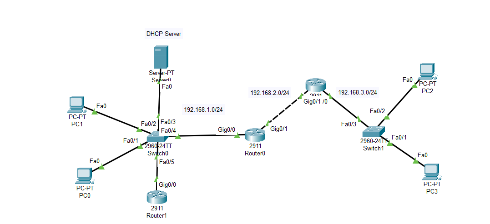

# DHCP Relay Agent – Packet Tracer Lab

## Project Overview
This project demonstrates the use of a **DHCP Relay Agent** in a routed network
where clients are located in multiple subnets and a centralized DHCP server
is deployed in a different network.

The lab is implemented using **Cisco Packet Tracer** and focuses on
realistic enterprise-style IP addressing and routing behavior.

---

## Network Problem
DHCP uses **broadcast messages** (DHCPDISCOVER), which **cannot cross routers**.
As a result, hosts located in remote subnets are unable to obtain IP addresses
from a centralized DHCP server by default.

---

## Solution: DHCP Relay Agent
To solve this issue, a router acting as a **DHCP Relay Agent** is configured using
the `ip helper-address` command. This allows DHCP requests to be forwarded
as unicast packets to the DHCP server located in another subnet.

In this lab:
- The DHCP server is located in the `192.168.1.0/24` network
- Clients exist in both local and remote subnets
- Router2 forwards DHCP requests to the DHCP server

---

## 🗺️ Network Topology


### Subnet Overview
| Network | Purpose |
|-------|--------|
| 192.168.1.0/24 | DHCP Server + Local Clients |
| 192.168.2.0/24 | Transit Network (OSPF) |
| 192.168.3.0/24 | Remote Clients |

---

## ⚙️ Technologies Used
- Cisco Packet Tracer
- Cisco 2911 Routers
- Cisco 2960 Switches
- DHCP Server (Server-PT)
- OSPF (Single Area)
- DHCP Relay Agent (`ip helper-address`)

---

## 🔧 Key Configurations

### DHCP Relay Agent
The DHCP relay function is configured on **Router2**, which connects the
remote client network to the rest of the topology.

```txt
interface GigabitEthernet0/0
 ip address 192.168.3.1 255.255.255.0
 ip helper-address 192.168.1.5

Routing

OSPF is used to provide dynamic routing between all routers and networks.

    Test Scenario

    Clients in 192.168.1.0/24 obtain IP addresses directly from the DHCP server

    Clients in 192.168.3.0/24 successfully receive IP addresses via DHCP relay

    End-to-end connectivity is verified using ICMP (ping)

Repository Structure

dhcp-relay-agent-lab/
├── packet-tracer/
│   └── dhcp-relay.pkt
├── topology/
│   └── topology.png
├── configs/
│   ├── router0.txt
│   ├── router1.txt
│   ├── router2.txt
│   └── dhcp-server.txt
├── README.md
└── LICENSE

Notes

    Packet Tracer DHCP servers do not support CLI-based configuration.
    For this reason, DHCP settings are documented in dhcp-server.txt.

    This lab focuses on fundamental DHCP and routing concepts, not security
    mechanisms such as DHCP Snooping or ACLs.

Possible Improvements

    VLAN segmentation

    DHCP Snooping

    Redundant DHCP servers

    Access Control Lists (ACL)

    HSRP for gateway redundancy

👤 Author
Created By muratEfeN
